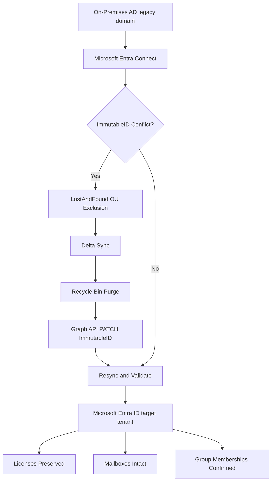

# IAM-007 - Enterprise Hybrid Identity Migration

> OmniVerse Enterprise Engineering Portfolio

[Back to Portfolio](https://github.com/KSWISHA9)

Enterprise hybrid identity migration case study - 61 users hard-matched from on-premises Active Directory to Microsoft Entra ID via Entra Connect with ImmutableID conflict resolution and zero errors.

---

## Table of Contents

- Business Request
- Architecture
- Engagement Summary
- Evidence Gallery
- Hard-Match Workflow
- Skills Demonstrated
- Technologies
- Repository Structure
- Lessons Learned
- Future Enhancements
- Related Projects

---

## Business Request

A simulated enterprise tenant required a domain migration from a legacy Active Directory namespace to a new cloud identity namespace. On-premises Active Directory accounts needed to be hard-matched to existing Microsoft Entra ID cloud accounts to preserve user data, licenses, mailbox continuity, and group membership with zero disruption.

---

## Architecture



---

## Engagement Summary

| Item | Detail |
|---|---|
| Environment | Sanitized enterprise tenant case study |
| Source Namespace | Legacy on-premises Active Directory domain |
| Target Namespace | Microsoft Entra ID cloud tenant |
| Users Migrated | 61 |
| ImmutableID Conflicts | Resolved for all affected accounts |
| Method | Entra Connect hard-match via Microsoft Graph API PATCH |
| Outcome | Zero errors, zero user disruption |
| Duration | Single migration window |

---

## Evidence Gallery

These screenshots document the migration workflow from discovery through validation and show the purpose of each step.

### Identity Audit


Shows the initial Entra ID account review used to identify cloud-only, synced, disabled, and conflict-prone users before any migration changes were made.

### Discovery Classification


Shows how users were grouped into migration categories, including soft-match candidates, hard-match candidates, cloud-only accounts, and disabled accounts.

### Pre-Flight Health Check


Shows the readiness check used to confirm sync health, required modules, tenant connectivity, and migration prerequisites before execution.

### Two-Object Conflict Pattern


Shows the duplicate-object condition that required ImmutableID hard-match remediation.

### Pilot Hard-Match Success


Shows the pilot validation used to confirm the hard-match process worked on a controlled account before batch migration.

### Batch Migration Summary


Shows the migration batch outcome, including users processed, accounts matched, conflicts resolved, and final migration status.

### Post-Migration Validation


Shows post-migration checks for synced state, ImmutableID alignment, license continuity, mailbox continuity, and group membership.

### Rollback Readiness


Shows the rollback validation process used to confirm a recovery path was available if a migration step failed.

Additional screenshots are available in the [screenshots](screenshots/) folder.

---

## Hard-Match Workflow

The ImmutableID hard-match process for each conflicting object:

1. Move conflicting object to LostAndFound OU to exclude from sync scope.
2. Run delta sync to clear the conflict in Entra ID.
3. Purge the soft-deleted object from Entra Recycle Bin.
4. PATCH the cloud account ImmutableID via Microsoft Graph API.
5. Return the on-premises object to its correct OU.
6. Run delta sync to complete the hard-match.
7. Validate attribute parity and group memberships.

---

## Skills Demonstrated

- Enterprise Domain Migration
- Microsoft Entra Connect Administration
- ImmutableID Hard-Match Resolution
- Microsoft Graph API Operations
- Conflict Detection and Pre-Migration Assessment
- Delta Synchronization Management
- Post-Migration Validation
- License and Mailbox Continuity
- Enterprise IAM Migration Case Study
- Zero-Downtime Migration Execution

---

## Technologies

| Technology | Purpose |
|---|---|
| Microsoft Entra ID | Cloud identity platform |
| Microsoft Entra Connect | Hybrid sync engine |
| Microsoft Graph PowerShell | ImmutableID PATCH operations |
| Active Directory | On-premises identity source |
| Exchange Online | Mailbox continuity validation |
| PowerShell 5.1 | Conflict detection and validation |

---

## Repository Structure

```text
IAM-007-Enterprise-Hybrid-Identity-Migration/
ss scripts/
ss     Detect-ImmutableIDConflicts.ps1
ss     Resolve-HardMatch.ps1
ss     Validate-PostMigration.ps1
ss     Export-MigrationReport.ps1
ss docs/
ss     Hard-Match-Runbook.md
ss     Two-Object-Pattern.md
ss     Lessons-Learned.md
ss screenshots/
ss README.md
```

---

## Lessons Learned

- ImmutableID conflicts always occur when cloud accounts were created manually before Entra Connect sync was configured.
- The LostAndFound OU exclusion pattern is the safest way to stage conflicting objects without deleting them.
- Entra Recycle Bin purge is required before a hard-match PATCH will take effect.
- Delta sync is faster than full sync for validating individual fixes - run it between each batch.
- Always run a post-migration attribute parity check - silent mismatches cause license and mailbox issues later.

---

## Future Enhancements

- Automated conflict detection for pre-migration assessment
- Batch hard-match processing for large-scale migrations
- Migration validation dashboard
- Rollback runbook for failed migrations
- Integration with IAM-001 Hybrid Identity Engineering baseline
---

## Related Projects

| Project | Description |
|---|---|
| [INFRA-001 Enterprise Active Directory](https://github.com/KSWISHA9/INFRA-001-Enterprise-Active-Directory-Infrastructure) | DNS, DHCP, OUs, GPOs, 2,000 users |
| [IAM-001 Hybrid Identity Engineering](https://github.com/KSWISHA9/IAM-001-Hybrid-Identity-Engineering) | Entra Connect, sync, hard/soft match |
| [IAM-002 Enterprise Application Onboarding](https://github.com/KSWISHA9/IAM-002-Enterprise-Application-Onboarding-SSO) | SAML, OIDC, OAuth, SCIM, Keycloak |
| [IAM-003 Identity Lifecycle Automation](https://github.com/KSWISHA9/IAM-003-Identity-Lifecycle-Automation) | Joiner-Mover-Leaver, Graph, RBAC |
| [IAM-004 Conditional Access and Zero Trust](https://github.com/KSWISHA9/IAM-004-Conditional-Access-Zero-Trust) | MFA, CA policies, named locations |
| [IAM-005 Identity Governance](https://github.com/KSWISHA9/IAM-005-Identity-Governance) | PIM, Access Reviews, Entitlement Management |
| [IAM-006 Identity Operations and Risk Analytics](https://github.com/KSWISHA9/IAM-006-Enterprise-Identity-Operations-Risk-Analytics) | Risk scoring, dashboards, remediation |
| [IAM-007 Enterprise Hybrid Identity Migration](https://github.com/KSWISHA9/IAM-007-Enterprise-Hybrid-Identity-Migration) | Hybrid identity migration case study, 61 users |

---

Created by **Keshawn Lynch**
