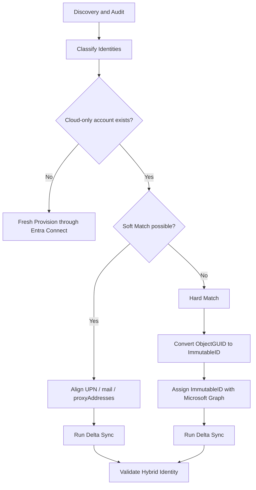

# Identity Migration Flow

```mermaid
flowchart TD
    A[Discovery and Audit] --> B[Classify Identities]
    B --> C{Cloud-only account exists?}
    C -- No --> D[Fresh Provision through Entra Connect]
    C -- Yes --> E{Soft Match possible?}
    E -- Yes --> F[Align UPN / mail / proxyAddresses]
    F --> G[Run Delta Sync]
    E -- No --> H[Hard Match]
    H --> I[Convert ObjectGUID to ImmutableID]
    I --> J[Assign ImmutableID with Microsoft Graph]
    J --> K[Run Delta Sync]
    G --> L[Validate Hybrid Identity]
    K --> L
```
