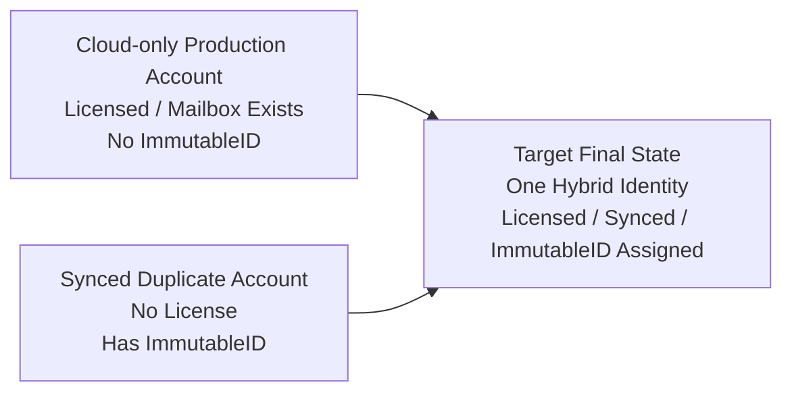

# Two-Object Pattern

```mermaid
flowchart LR
    A[Cloud-only Production Account<br>Licensed / Mailbox Exists<br>No ImmutableID] 
    B[Synced Duplicate Account<br>No License<br>Has ImmutableID]
    C[Target Final State<br>One Hybrid Identity<br>Licensed / Synced / ImmutableID Assigned]

    A --> C
    B --> C
```
